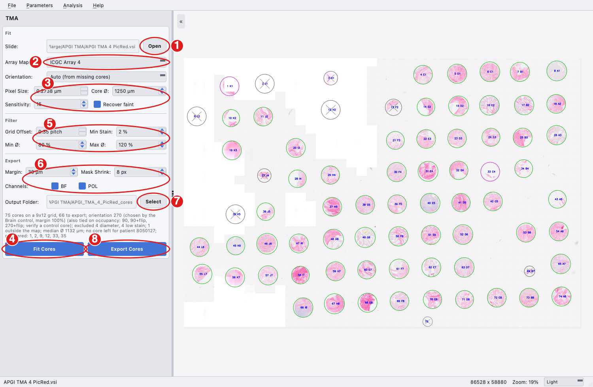

# Tissue Micro-Array (TMA) Preprocessing

Cabana can turn a whole-slide scan of a tissue micro-array into one image and
one binary mask per core, named by patient, ready for batch analysis. The
step lives on the **TMA** page of the GUI and in the `cabana-tma` command.

## What it does

1. **Load slide**: Olympus VS200 `.vsi` scans are read natively (no Java or
   Bio-Formats needed) from the `.vsi` file and its `_<name>_/stack*/` tile
   folders. Plain whole-slide TIFF/PNG exports are accepted too. Bright-field
   and polarised layers of a `.vsi` are exposed as the channels `BF` and `POL`.
   As soon as a slide is chosen a low-resolution preview appears in the image
   panel and the pixel size and available channels are filled in.
2. **Fit cores**: tissue is thresholded on a low-resolution level, a circle is
   fitted to every core, the circles are snapped to the array grid, and the
   grid is matched to the printed ICGC/APGI array map (arrays 1 to 8 are
   bundled). A numbered overlay is shown: green circles will be exported,
   purple were recovered at empty grid positions (also exported), grey with a
   cross were excluded by the quality filters, and grey lie outside the printed
   map; neither grey kind is exported.
3. **Export cores**: for every core and selected channel a square crop is
   written to `<channel>/<group>/Images/` and a circular mask (white inside the
   fitted circle, shrunk by *Mask Shrink*, black in the corners) to
   `<channel>/<group>/Masks/`. Channels are `BF` and `POL`; groups are
   `Patients`, `Controls` (Liver, Brain, … from the map) and `Unmapped` (cores
   without a map entry, e.g. when no array map is chosen). A `cores.csv`
   manifest and `overlay.png` are written alongside.

The three stages run independently: fitting can be repeated with new settings
before exporting, and exporting can be repeated into a different folder.

## The TMA page



1. **Open** the slide (`.vsi`, or a whole-slide TIFF/PNG, in which case enter the
   pixel size). A preview appears in the viewer.
2. **Array Map.** Choose the printed ICGC/APGI array (1 to 8) for patient IDs,
   or *None* to name cores by grid position only. Leave **Orientation** on
   *Auto* unless you need to force one (see [Orientation](#orientation)).
3. **Fit settings.** *Core Ø* is the nominal core diameter and sets the scale
   of every step; *Sensitivity* is the tissue threshold; *Recover faint* looks
   for pale cores at empty grid positions.
4. **Fit Cores** fits the circles and matches the map. The overlay shows every
   core with its number and map position; the status line below the settings
   summarises the fit and any warnings.
5. **Filter.** Quality gates applied after fitting; they update the overlay
   instantly without a refit (see [Quality filters](#quality-filters)).
6. **Export settings.** *Margin* around each circle, *Mask Shrink*, and the
   channels (BF, POL) to write.
7. **Output Folder** for the export (defaults to `<slide>_cores` beside the
   slide).
8. **Export Cores** writes the images, masks, `cores.csv` and `overlay.png`.
   When it finishes you are offered to point **Batch Run** at the exported
   Patients folder of a channel.

## How core fitting works and how to tune it

1. **Tissue mask.** On a level of about 4 µm/px, a pixel is tissue when its
   HSV saturation exceeds *Sensitivity* (default 15) or it is darker than
   96.5% of the background brightness of its image column (the per-column
   reference cancels scanner banding). The column background is measured only
   from pixels close to the slide's overall background level, so that tissue,
   the white fill of unscanned areas and the faint off-white stripes scanners
   leave there cannot bias it; this matters for partly scanned slides, where a
   column may be mostly unscanned. Flat, unsaturated bright regions away from
   that level (white fill, the grey padding written beyond the scanned frame)
   carry no data and are never counted as tissue.
2. **Clean-up.** Gaps of up to 30% of a core diameter are closed so a core
   becomes one blob; an opening of 10% of a core diameter then cuts off thin
   structures such as coverslip edges, scratches and streaks.
3. **Components.** Blobs smaller than 5% of the largest are dropped. Inside
   each blob detached debris smaller than 5% of the main tissue mass is
   removed, and the minimum enclosing circle of what remains is the core.
   Circles larger than 1.5 or smaller than 0.2 nominal core diameters are
   rejected (fused neighbours, dust).
   Because an enclosing circle is set by its outermost points, debris next
   to a core would inflate it. Circles larger than 110 % of the slide's median
   radius are therefore rebuilt from the largest tissue piece (split at thin
   attachments if it is itself too large), adding neighbouring pieces nearest
   first only while the circle stays within that size.
4. **Grid.** Circle centres are snapped to a lattice whose pitch is the
   median neighbour distance. Circles falling in one cell are merged largest
   first, and a smaller one is only merged if the result stays within 110 % of
   the typical core radius, so a debris speck in the same cell is dropped
   rather than enlarging the core.
5. **Recovery.** With *Recover faint* on, every empty grid position is tested
   with a permissive threshold (half the saturation, twice the brightness
   margin). If at least 3% of the expected disc is tissue, a core is added
   there with the median radius and flagged `recovered` (purple on the
   overlay). Positions with less tissue stay empty.
6. **Fill.** The fraction of each circle covered by tissue is recorded in
   `cores.csv` (`fill`) for reference.

Tuning: lower *Sensitivity* (for example 8) when very pale cores are missed
and debris is not a problem; raise it (25 to 30) when shading or dust on the
glass is being fitted. *Core Ø* sets the scale of every morphological step
and of the size gates, so set it to the real core diameter first. On the
command line the same knobs are `--sat-thresh`, `--val-ratio`, `--min-fill`
and `--no-recover`.

## Quality filters

After the cores are fitted and patient IDs assigned, each core is measured and
checked against the **Filter** settings. Excluded cores stay in `cores.csv`
(columns `excluded`, `reason`, plus the measured `grid_offset`, `diameter_um`,
`fill`, `stain_frac`), are drawn grey with a cross on the overlay, and are not
exported. Filters update instantly; no refit is needed.

| Setting | Excludes a core when | Default |
|---|---|---|
| Grid Offset | its centre is further than this from its grid position, in core spacings | 0.35 |
| Min Ø / Max Ø | its fitted diameter is outside this range, as % of Core Ø | 80 % / 120 % |
| Min Stain | less than this fraction of the circle has HSV saturation above 40, i.e. the core is empty or unstained (control cores exempt) | 2 % |

Filters never change patient IDs. The orientation match ignores only objects
more than half a core spacing from any grid position, a fixed rule, and all
filters run after IDs are assigned. The status line reports how many cores each
filter removed, the median fitted diameter (with a warning when Core Ø differs
by more than 10 %), and any patient left with no core.

On the APGI slides the weakest genuine patient cores have 3 to 5 % stained
area and the Brain and Muscle controls about 0 to 1 %, which is why the stain
default is 2 %. Core Ø defaults to 1250 µm, the fitted size of the APGI
cores; the diameter range is only meaningful when Core Ø matches the array, so
change it for other arrays (the status line warns when the median fitted
diameter differs from Core Ø by more than 10 %). Partial or torn cores fit a
smaller circle; lower Min Ø (for example to 70 %) to keep them.

CLI: `--max-grid-offset`, `--diameter-range MIN MAX`, `--min-stain`, and
`--stain-sat` (the saturation threshold, 40, not exposed in the GUI).

## Output naming

```
<patientID>.vsi - <slide>_<channel>_<position>Annotation (<class>)_<n>.png   e.g. 8010718.vsi - TMA1_BF_A3Annotation (Tumour)_1.png
<tissue>.vsi - <slide>_<channel>_<position>Annotation (<tissue>)_<n>.png      e.g. Liver.vsi - TMA1_BF_A1Annotation (Liver)_1.png   (control cores)
<slide>-r<row>c<col>.vsi - <slide>_<channel>_r<row>c<col>Annotation (Unmapped)_1.png   (no array map selected or unmapped cell)
```

The names follow the pattern of the QuPath slide exports Cabana was built
around, so that the per-patient statistics and scores of a batch run identify
the patient from the prefix before `.vsi`, the channel from `_BF_`/`_POL_`,
the class from the last bracket and the replicate from the trailing number.
`<class>` is the map note where one exists (for example PNET, MCN), otherwise
`Tumour`; `<n>` numbers the patient's cores on the slide in row-major order.
`position` is the flat map position (rows A to L, columns 1 to 8) after the
printed sector offsets are resolved; the ICGC ID is in `cores.csv`. `cores.csv` records the map label,
sector, patient ID, ICGC ID, tissue, circle centre and radius (level-0 pixels),
tissue fill, QC metrics, flag, exclusion reason, export group (`Patients`,
`Controls` or `Unmapped`), and the orientation used together with the rule
that decided it (`orientation_method`).

## Orientation

The scan is typically rotated relative to the printed map. *Auto* compares the
pattern of missing cores with the map for all eight rotations and mirror
images. A fully populated array cannot distinguish a rotation from its mirror
image, so when several orientations tie Cabana breaks the tie by appearance:

1. **Brain control.** Brain tissue is nearly collagen-free, so the core at
   the map's Brain position must be almost unstained (under 5 % stained area,
   and clearly paler than under the other candidates). Arrays 1 to 5 have a
   Brain core.
2. **Replicate similarity.** Each patient's three cores come from one tumour
   and should look alike (stained fraction, saturation, darkness, fill; each
   feature is z-scored across the slide so none dominates). Under a wrong
   orientation the "triplets" are unrelated patients. The orientation with
   the most self-similar triplets wins if it leads the runner-up by at
   least 10 %.

The status line and `cores.csv` (`orientation_method`) say which rule decided
and by what margin. If neither rule separates the candidates the orientation
is **unresolved**: the overlay still shows provisional labels, but Export is
disabled until you confirm a control core against the printed map and set the
orientation explicitly (the CLI exits with an error unless `--orientation` is
given). Orientation genuinely differs between slides of this set, so never
assume one value for a batch.

## Using the export in Cabana

Each group folder is a self-contained batch input: `BF/Patients/Images/` is
the input folder and `BF/Patients/Masks/` the ROI-mask folder of **Batch
Run**, and likewise for `Controls/` and for `POL/` (the GUI's "Use BF in Batch
Run" and "Use POL in Batch Run" point at the Patients folders). Keep the
controls for checking staining consistency between slides; exporting several
slides into one output folder collects every slide's controls in
`<channel>/Controls/`. Controls are exempt from the stain filter but not from
the grid-offset and diameter filters. Run the channels separately: bright-field with
Dark Line on, polarised with Dark Line off. With a mask, the corners of each
crop are excluded from segmentation, fibre detection, HDM, fibre-area and gap
metrics, and the percentage metrics are relative to the circle area. The
masks are honoured whether segmentation is enabled or not.

Cores scanned at 20x are about 4000 to 5000 pixels across. Raise
`Segmentation: Max Size` in the parameter file (for example to 6000) so that
each core is analysed as one image, and consider `Segmentation: Patch Size`
(for example 1024) so the segmentation network sees the tissue at a useful
resolution instead of the whole core shrunk to 512 pixels.

## Command line

```bash
cabana-tma "APGI TMA 1 PicRed.vsi" out/TMA1 --array 1 --slide-name TMA1
cabana-tma slide.tif out/slide --pixel-size 0.5 --fit-only        # cores.csv + overlay only
cabana-tma slide.vsi out/x --array 4 --orientation 90+flip --channels BF
```

Run `cabana-tma --help` for all options (core diameter, crop margin, mask
shrink, channel selection).

## Python API

```python
from cabana import TMAPreprocessor

pre = TMAPreprocessor("APGI TMA 1 PicRed.vsi", array_number=1, slide_name="TMA1")
pre.fit()                      # list of Core objects with centre, radius, grid position
pre.map_to_array()             # orientation, sets map positions; pre.orientation_ties lists ambiguities
pre.export("out/TMA1", channels=["BF", "POL"])
```
