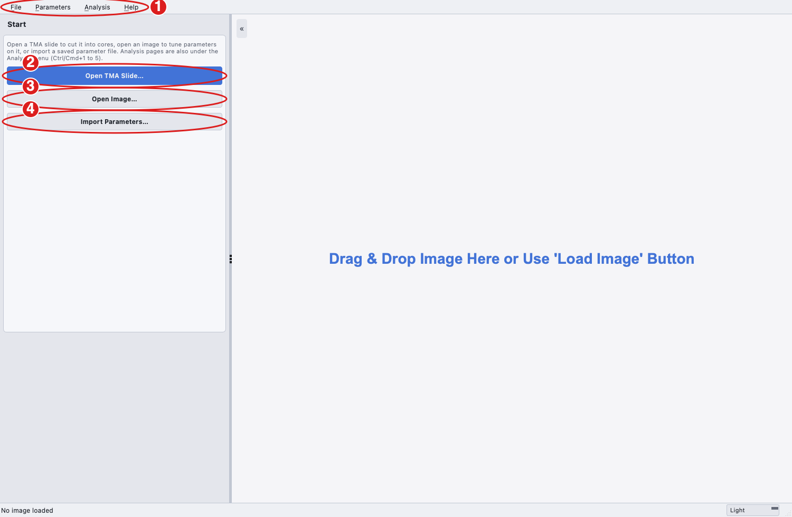
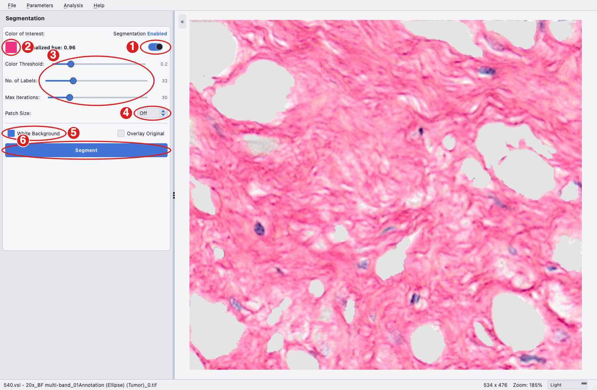
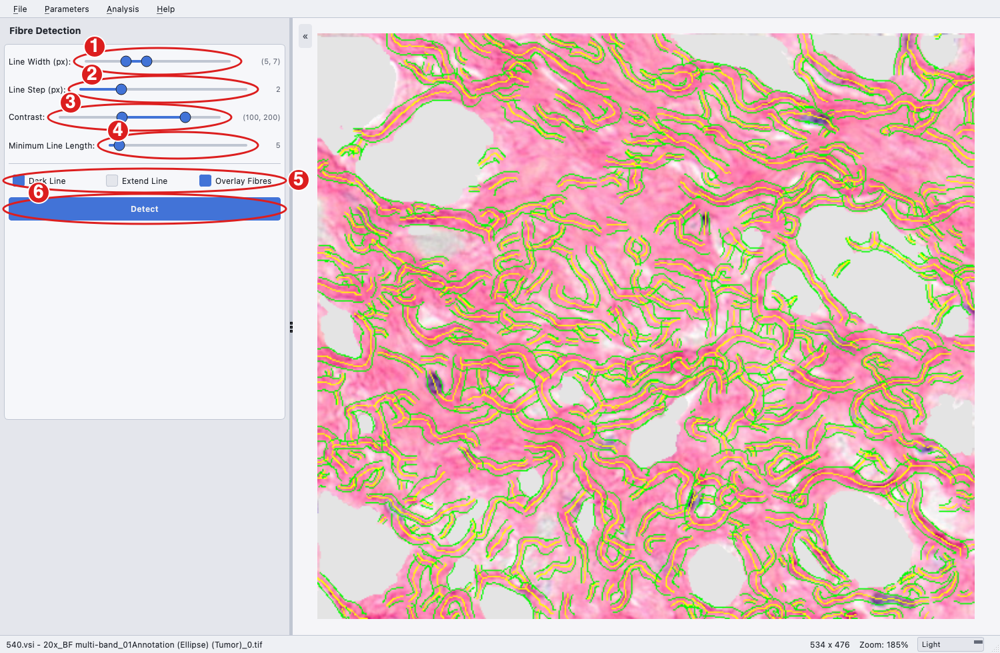
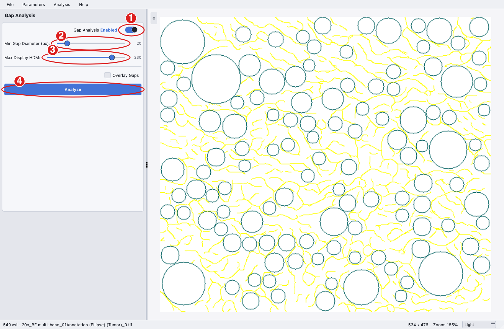
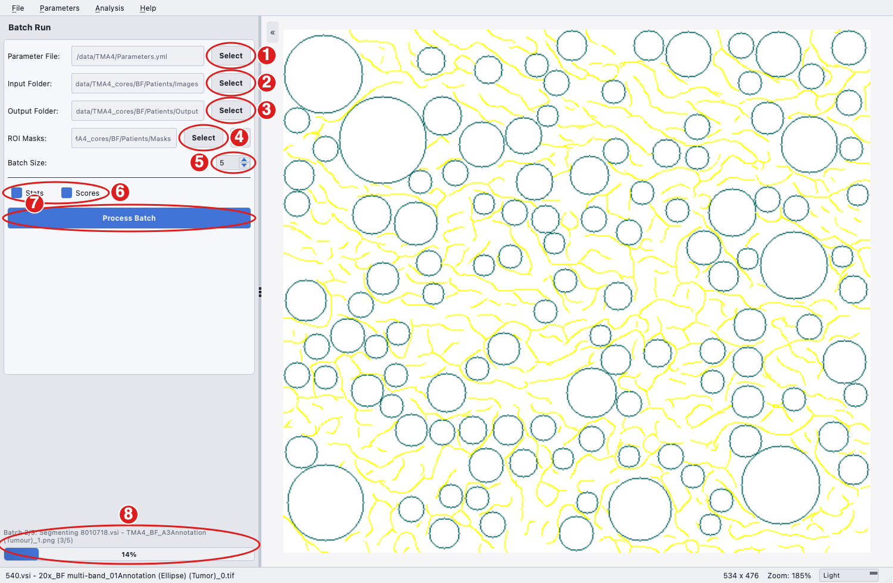
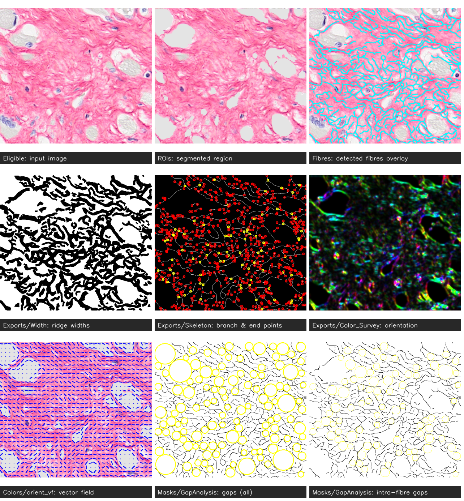

# Image Analysis Workflow

Once the Cabana GUI is launched, you will see a window split horizontally: the control panel on the left and the image viewer on the right. The program is designed to let you:

1. experiment with parameters for different components using your data,
2. export the optimised parameters for batch processing on larger datasets, and
3. cut tissue micro-array (TMA) slides into per-core images and masks ready for batch processing (see [TMA preprocessing](tma.md)).

1. **Menu bar.** All commands live here: **File** (open or reload an image, open a TMA slide, quit), **Parameters** (import, export, restore defaults), **Analysis** (choose which page the control panel shows: **TMA**, **Segmentation**, **Fibre Detection**, **Gap Analysis** or **Batch Run**, shortcuts Ctrl/Cmd+1 to 5) and **Help** (about, documentation, issue tracker, version, licence).
2. **Open TMA Slide** opens a whole-slide scan on the TMA page.
3. **Open Image** loads a single image to tune parameters on; the panel switches to Segmentation automatically. You can also drag an image onto the viewer.
4. **Import Parameters** loads a saved `Parameters.yml` into the controls.

The control panel shows one page at a time. Hover any label or control for a short description; the same hint appears in the status bar at the bottom, which also shows the loaded file, its size and the zoom. The theme selector sits at the bottom right.

To begin, select a representative image from your dataset, then work through the Segmentation, Fibre Detection and Gap Analysis pages in that order to determine the settings for your analysis.

## Segmentation

1. **Segmentation toggle.** Turns the segmentation step on or off for both the GUI and batch runs. If the background is clean, segmentation may not be needed.
2. **Colour of Interest.** Click the swatch to pick the stain colour directly from the image; the **Normalised Hue** (in [0, 1], HSB/HSV colour space) is shown next to it. To pick from the original image again, use **File > Reload Image**.
3. **Colour Threshold** is the minimum mean colour distance for a segment to count as region of interest (ROI); **No. of Labels** controls the granularity of the segmentation; **Max Iterations** limits the training of the segmentation network.
4. **Patch Size.** Off by default, meaning the whole image is shrunk to 512 px for the segmentation network. Set a size (for example 1024 px) to segment large images in overlapping square patches instead; each patch is shrunk to 512 px and the colour-distance maps are blended before thresholding, so fine detail survives on images of several thousand pixels such as TMA cores.
5. **White Background.** Fills the non-ROI area with white (default). Disable it when detecting bright fibres on a dark background. **Overlay Original** blends the segmentation with the original image in the viewer.
6. **Segment** runs the step; the result replaces the image in the viewer.

## Fibre Detection

1. **Line Width (px).** Minimum and maximum width of the ridges to detect.
2. **Line Step (px).** Sampling interval for line widths between the minimum and maximum.
3. **Contrast.** Lower and upper greyscale contrast thresholds between fibres and background.
4. **Minimum Line Length (px).** Shorter fibres are ignored.
5. **Dark Line** detects dark fibres on a light background (Picrosirius Red); disable it for bright fibres on a dark background (fluorescence, SHG). **Extend Line** enables detection near junctions and may produce artefacts, so use it with caution. **Overlay Fibres** draws the detected fibres over the image in the viewer.
6. **Detect** runs the step on the segmented image when segmentation is enabled, otherwise on the original.

## Gap Analysis

1. **Gap Analysis toggle.** Turns the gap analysis step on or off for the GUI and batch runs.
2. **Min Gap Diameter (px).** The smallest gap to report.
3. **Max Display HDM.** The maximum intensity value of the high-density matrix.
4. **Analyze** runs the gap analysis on the detected fibres; **Overlay Gaps** draws the gaps over the image.

## Exporting parameters

Once the settings on the three pages are chosen, use **Parameters > Export Parameters** to write them to a parameter file, for example `Parameters.yml`, for batch processing. **Parameters > Import Parameters** loads such a file back into the controls and **Parameters > Restore Defaults** resets them. Parameters with no control in the GUI (for example `Segmentation: Max Size` or the curvature windows) can be edited in the file directly; see [Parameter Details](parameters.md).

## Batch Processing

1. **Parameter File.** The exported `Parameters.yml`. Review it first, for example to disable segmentation or gap analysis or to raise `Max Size` for large images.
2. **Input Folder.** The folder of images to quantify (tif, png and jpg are supported).
3. **Output Folder.** Where the results are written.
4. **ROI Masks** (optional). A folder of binary masks named like the input images (white = analyse, black = ignore), such as a `BF/Patients/Masks/` or `POL/Patients/Masks/` folder written by the TMA page, restricts every measurement to the masked region. Leave it empty to rely on segmentation alone. The mask folder is a per-run path like the input and output folders; it is not stored in the parameter file, but the folder used is recorded in `version_params.yaml` in the output folder.
5. **Batch Size.** Images are processed in batches (default 5) so that an interrupted run can be resumed.
6. **Stats** and **Scores** add per-patient statistics (`QuantificationResults_MEAN_STD_SEM.csv`) and collagen risk scores (`QuantificationResults_SCORES.csv`) to the output; they require the TMA naming scheme.
7. **Process Batch** starts the run; the button turns into **Cancel** while it runs.
8. While a run is in progress a status line above the progress bar names the current batch, stage and image. The bar weights segmentation by its cost (one CNN training run per image, or per patch when Patch Size is on), so it keeps moving through that slow stage.

If a run is cancelled or stops with an error, the completed batches and a checkpoint are kept. Start Batch Run again with the same output folder and accept the resume prompt to continue from the last finished batch.

## Cabana Outputs

Cabana generates an output folder containing the subfolders below. The figure shows the main per-image result images for the sample Picrosirius Red image.

i. **Batches**

   Stores the results of each analysis batch. Cabana processes images in batches to allow the use of a check-point in case the analysis run crashes and needs to be restarted (see below under 'errors'). The results of all batches are combined into the folders below, after which the Batches folder and the checkpoint are removed automatically. They are only left in place when a run fails (the GUI reports the error and keeps everything) or is cancelled, so that it can be resumed by running again with the same output folder; once such a run has been completed or abandoned they can be deleted to save storage space.

ii. **Bins**

   Stores the binary masks resulting from ROI extraction. The ROI regions are highlighted in white while backgrounds are highlighted in black.

iii. **Colors**

   Stores subfolders of each processed image with the images of the following analysis results:

   a. all_gaps: gap analysis of whole tissue
   b. angular_hist: angular distribution of fibre orientations.
   c. color_coherency: orientation coherency/alignment in a local window =2 for OrientationJ plugin) of the original image. The rule of thumb for the filter size is to be about 3 times the standard deviation (sigma value) in each direction, i.e. window size ~6*2=12px.
   d. colour_curve: vector field visualization of orientation, with vector lengths weighted by coherency.
   e. colour_energy: vector field visualization of orientation, with vector lengths weighted by energy, i.e., gradient vector magnitude.
   f. colour_length: detected ridges are colour-coded according to fibre length. Note: this only applies to fibres without branches.
   g. colour_mask: detected ridges and branches
   h. colour_orientation: fibre orientation in [] within a local window
   i. colour_skeleton: detected fibres with branchpoints (yellow) and endpoints (green)
   j. colour_width: detected ridges with calculated fibre widths
   k. gray_width: widths in terms of integer pixel numbers at ridge points/pixels.
   l. intra_gaps: gap analysis of intra-collagen fibre gaps
   m. orient_colour_survey: color coding of orientation in HSB colour space, where hue is orientation, saturation is coherency, brightness is the grayscale of the original image.

   

   n. orient_vf_constant: vector field visualization of orientation with constant/equal weights

iv. **Eligible**

   Stores the images to be analysed after the removal over-sized images. The 'Ignored_images.txt' file inside the subfolder records the names of the over-sized images that have been ignored.

   Note: images that are larger than 2048 x 2048 pixels will automatically be cropped into subregions < 2048 x 2048 px and saved as individual ROIs.

v. **Exports**

   Contains colour-code images of following results:

   a. Coherency: coherency/alignment of orientation in a local neighbourhood
   b. Colour survey: same as above in 3.m
   c. Curve map: curvatures of the detected fibres for selected curvature window sizes
   d. Energy: magnitude of gradient vector 
   e. GapImage: Map of tissue gaps (red) -- based on non-segmented image
   f. GapImage_intra_gaps: Map of intra-fibre gaps (green) -- based on segmentation ROI
   g. Length map: pixel intensities represent fibre length in µm, stored as 32-bit floats (float32 TIFF).
   h. Mask: detected fibres and fibre branches
   i. Orientation: orientation angles in radians ranging from to.
   j. Skeleton: shows branchpoints (yellow circles) and endpoints (red circles) of detected fibre spines
   k. Width: ridge detection results with the estimated ridge width

vi. **HDM**

   Stores the high-density matrix areas as defined in Parameters.yml

vii. **Masks**

   Stores the results of ridge detection and of the gap analysis in the 'GapAnalysis' folder. The 'GapAnalysis' folder comprises of two output images for each image. One image features red circles, visualizing the gaps between fibres of the non-segmented image.

   The second image shows green circles depicting gaps within collagen fibre areas (intra-collagen gaps) of the segmented image.

viii. **Fibres**

   Stores the visualization results of ridge detection as an overlay with the original image.

ix. **ROIs**

   Stores the results of the image segmentation.

x. **ROIMasks**

   Present when an ROI mask folder was given: the external mask of each analysed image (or block), resized and cropped to match it. Measurements are restricted to the white region of these masks.

xi. **QuantificationResults.csv**

   Contains all resultant image statistics, one row per analysed image or block. Please refer to [Read-outs](readouts.md) for a detailed explanation of every column.

   With **Stats** ticked, `QuantificationResults_MEAN_STD_SEM.csv` adds the mean, standard deviation and standard error per patient over that patient's images. Patients are identified from the image name: the prefix before `.vsi`, which is how both QuPath slide exports (`K324.vsi - 20x_BF_01Annotation (Tumor)_1`) and the TMA core export (`8010718.vsi - TMA1_BF_A3Annotation (Tumour)_1`) name their files; otherwise the first token of the name is used. With **Scores** ticked, `QuantificationResults_SCORES.csv` adds the Rigidity and Bundling collagen risk scores computed from those per-patient means.

   The output folder also contains `version_params.yaml` with all parameters used for the run, the Cabana version and git commit, the user and time, and the folders used (including the ROI mask folder), for tracking and reproducibility.
